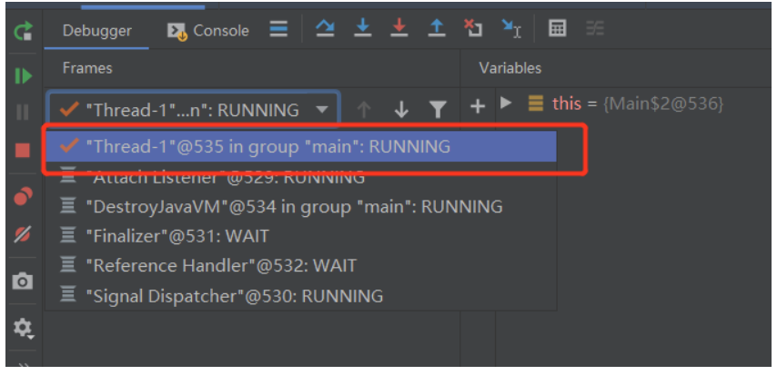

### 1. 为什么需要多线程
Java世界中默认情况下是单线程的。这种方式处理问题使用的是线性逻辑，一个任务完成了再执行下一个任务，非常容易让人类理解。
但也会带来一些问题，如下几个就是其中最典型的：

- CPU的速度远远大于内存、磁盘的读写速度。所以内存、磁盘在工作时，CPU就只能等着了。这样就极大的浪费了CPU的资源。
- Java的执行模型是同步、阻塞的。只能执行完一行代码，再执行下一行。同样的，这些等待的资源明明可以执行其他任务，现在却被浪费了。
- 现代的CPU都是多核的，本身就支持同时做多件事情。硬件上已经支持多线程了，为什么不利用它们的优势呢？ 
   
正因为有上面这些问题，才使得Java多线程被引入的各种项目实现中。


### 2.如何开启一个新的线程
Java中的线程对象是**Thread**。开启一个新的线程需要用**Thread**中的`start()`方法，只有`start()`可以让线程**并发运行**。而 `run()`，线程依然是**线性执行的。这一点，一定要注意了！**

如下代码为例的，Thread1可以不等`slowFileOperation()` 方法执行完就开始执行Thread2。 而使用`run()`的话，Thread1只有在自己的`slowFileOperation()` 执行完毕后才可以执行Thead2.

```java
public static void main(String[] args) {
       //Thread 1
       new Thread(new Runnable() {
              public void run() {
                  slowFileOperation();
              }
        }).start();
        
        //Thread 2
         new Thread(new Runnable() {
              public void run() {
                  slowFileOperation();
              }
        }).start();
        
        //简化
        //new Thread(()->slowFileOperation()).start();
        //再简化
        //new Thread(Main::slowFileOperation).start();
    }

    public static void slowFileOperation(){
        System.out.println("I am running");
    }

```

可以用调试器观察到正在运行的线程的栈针，图中显示线程的确是被创建出来了。




### 3.线程的重要方面：私有的与共享的变量

#### 3.1 方法栈（局部变量）是线程私有的，多个线程间不会互相影响
这个和单线程是一样的，方法中的局部变量都是当前方法独有的。这个原则同样也适用于多线程


#### 3.2 静态变量、类变量是所有线程共有的
我们有时需要把不同线程的结果收集起来，或者说用一个可以被线程共享的变量把线程的结果收集起来。而这种共享的变量，**几乎是线程问题所有问题的来源。**

我们可以用一个例子来说明一下。如下方所示，代码的逻辑很简单，就是创建很多线程，每个线程都会对**共享变量i**进行自增，然后打印出来。但最后的结果显示：打印出来的数字是不定的，也会出现连续打印几个相同数字的情况。

```java
public class Main {
    private  static  int i = 0;
    public static void main(String[] args) {
        for(int i = 0;i<1000;i++)
        {
            new Thread(new Runnable() {
                public void run() {
                    slowFileOperation();
                }
            }).start();
        }
    }

    public static void slowFileOperation(){
        i++;
        System.out.println(i);
    }
}
```


造成这种情况的原因就是：**多个线程共享了一个静态变量。** 线程1完成i的自增后，CPU分配给它的时间用完了。然后CPU立即去执行线程2了，线程2完成了i的自增与赋值，把i变为了1。此时，再回过头去完成线程1，把线程1自增后的值赋给i，i依然是1。这就是有重复值的原因。

最后打印出的数字是不定的，这个原因也是类似的：因为CPU在执行线程的顺序是不定的，这次把线程1压在了最后，下次又把线程2压在了最后。


### 4. 线程带来的性能提升
多线程并不是万能的，它也有自己的使用场景。

1. 对于IO密集型应⽤极其有⽤ 
- ⽹络IO（通常包括数据库） 
- ⽂件IO • 对于CPU密集型应⽤稍有折扣 

2. 性能提升的上限在哪⾥？ 
 单核CPU 100% • 多核CPU N*100%


